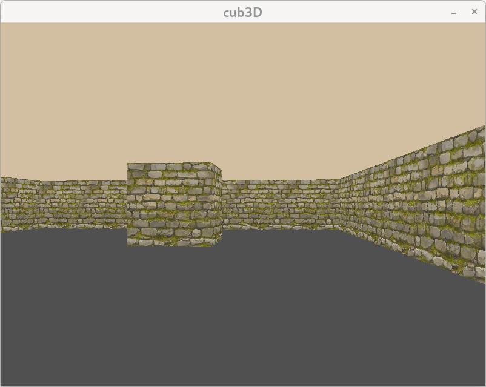

# 🧱 cub3D – Raycasting in C  
## Made by [@Seela Salorinta](https://github.com/SeelaSalorinta) & [@Jimi Karhu](https://github.com/gitenjoyer95)

cub3D is a minimalist 3D engine built using **raycasting**, inspired by the original Wolfenstein 3D.  
It parses a `.cub` config file and renders a 3D world based on a 2D map, with texture support, colors, movement, and camera rotation.



---

## ⚙️ How to Run

```bash
make
./cub3D maps/map.cub
```

---

## 🎮 Controls

- W / S → Move forward / back  
- A / D → Strafe  
- ← / → → Rotate  
- ESC → Exit  

---

## Features

- Raycasting engine (DDA)  
- Textures for walls (N/S/E/W)  
- Custom ceiling & floor colors  
- Closed map detection & validation  
- Smooth movement + rotation  
- Clean parsing & error messages  

---

## 📄 `.cub` File Example

```
NO ./textures/north.xpm
SO ./textures/south.xpm
WE ./textures/west.xpm
EA ./textures/east.xpm

F 60,60,60
C 220,200,160

111111
100001
10N001
100001
111111
```

---

## 👥 Authors

- **Seela** – textures, color parsing, config & map validation  
- **Jimi** – raycasting logic, DDA, projection & rendering  
